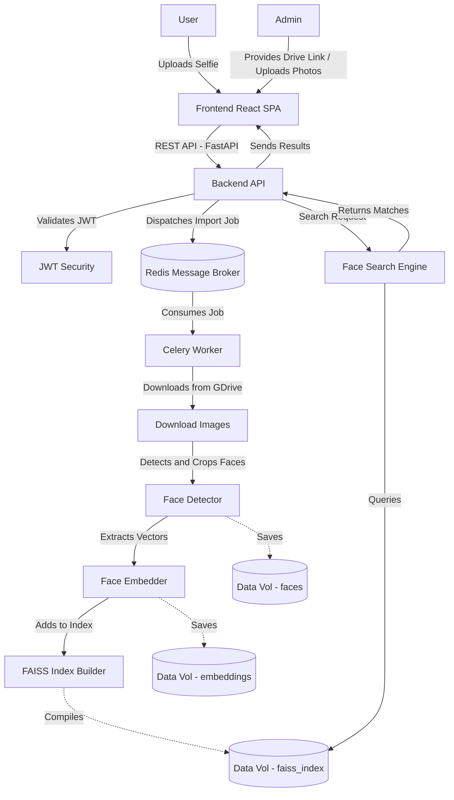

# FaceFind: AI Event Photo Search

FaceFind is a complete full-stack AI platform built to instantly search massive event photo libraries using facial recognition. 

Upload a selfie, and the application's AI pipeline extracts facial embeddings to return every single original, high-quality event photo you appeared in.


## 🚀 Features

- **AI Face Embeddings:** Powered by the state-of-the-art **InsightFace** (`buffalo_l`) model for extracting rich facial features.
- **Lightning-Fast Vector Search:** Uses **FAISS** (`IndexFlatIP`) with L2-Normalized Cosine Similarity for millisecond-speed matching across thousands of photos.
- **Smart Detection:** Automatically pads tightly cropped selfies so the detector never fails to recognize a face.
- **Modern Full-Stack Architecture:**
  - **Backend:** High-performance REST API built with **FastAPI**. Includes background task processing using **Celery** and **Redis**.
  - **Security:** Fully protected API endpoints using **JWT (JSON Web Tokens)**.
  - **Frontend:** Beautiful, responsive, premium Dark Mode SPA built with **React**, **Vite**, and **Tailwind CSS**.
- **Duplicate Handling:** Automatically maps multiple detected faces back to their actual source photo and deduplicates the results so users only see unique event images.

---

## 🏗️ Project Architecture & Data Flow

FaceFind is designed with a decoupled architecture, utilizing message queues for heavy AI workloads to keep the API responsive.

### Architecture Flow Diagram



### Directory Structure

```text
face-event-search/
├── data/                 # Mounted Docker Volume for persistence
│   ├── raw_images/       # 1. Place your raw event photos here
│   ├── faces/            # 2. Automatically cropped faces are saved here
│   └── embeddings/       # 3. Vector embeddings (.npy & .pkl)
├── database/             # 4. Compiled FAISS index (.bin)
├── app/                  # FastAPI Backend Server
│   ├── app.py            # Main API routes and CORS config
│   ├── auth.py           / security.py # JWT Authentication logic
│   ├── jobs/             # Job tracking and progress metrics (Redis)
│   └── workers/          # Celery background tasks (e.g., GDrive downloads)
├── frontend/             # React SPA 
│   └── react-app/        # Vite + React + Tailwind + Motion source code
├── src/                  # Core Python AI Engine
│   ├── admin_processor.py# Orchestrates new image insertion
│   ├── build_index.py    # FAISS index compilation
│   ├── face_detector.py  # InsightFace detection
│   ├── face_embedder.py  # Vector extraction
│   └── search_face.py    # Search query logic
└── docker-compose.yml    # Master orchestrator
```

---

## 🛠️ Installation & Setup (Dockerized)

This application is fully containerized. You do not need to install Python or Node.js on your machine!

### 1. Build and Start the Cluster

Make sure you have [Docker Desktop](https://www.docker.com/products/docker-desktop/) installed and running.

```bash
docker-compose up --build -d
```

This single command will spin up 4 interconnected containers:
1. **Frontend:** The React SPA UI (Port `5173`)
2. **Backend:** The FastAPI server (Port `8000`)
3. **Redis:** In-memory message broker (Port `6379`)
4. **Celery Worker:** Background task processor

### 2. Prepare Your Image Database (Initial Load)

You can bulk import event photos easily through the **Admin Dashboard** via two methods:
1. **Drag & Drop:** Upload photos directly from your computer.
2. **Google Drive Import:** Paste a public Google Drive Folder ID. The Celery worker will download all images natively in the background and pipe them into the AI engine.

If you prefer to load files manually via CLI, you can drop images into the `data/raw_images/` folder and run the pipeline scripts inside the backend container:

```bash
# Connect into the backend container
docker exec -it facefind-backend /bin/bash

# Find every face in every photo and crop them
python src/face_detector.py

# Convert the crops into vector arrays
python src/face_embedder.py

# Normalize the arrays and compile the FAISS index database
python src/build_index.py
```

---

## 🔑 Usage Guide

1. Open `http://localhost:5173` in your browser.
2. The system is protected by JWT authentication with role-based access control.
   - **Admin Login:** Enter `admin-1234`
   - **User Login:** Enter `user-1234`
3. **If logged in as User:** You can upload a selfie or a clear headshot of a person into the upload zone to perform a Face Search.
4. **If logged in as Admin:** You gain access to the **Bulk Image Upload** portal. You can drag and drop hundreds of new event photos into the browser. The backend will automatically run the AI pipeline on the new images and append them to the FAISS index without needing to use the CLI.
5. The API will process the searched image, match the embeddings using Cosine Similarity, and return all the original high-resolution event photos the person is featured in!
